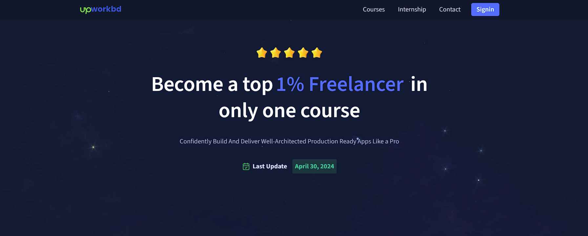
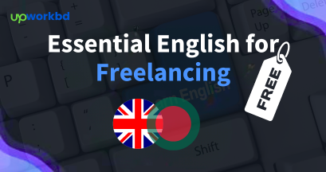

# Upworkbd - Freelance Developer Training Platform
=====================================================

 **Learn. Grow. Freelance.**

## Introduction
---------------

Welcome to Upworkbd, a platform dedicated to equipping students with the skills and knowledge necessary to succeed as freelance developers. Our mission is to provide a comprehensive learning experience, focusing on full-stack development, to help students launch their careers in the freelance industry.

## Courses Offered
-----------------

### Full-Stack Development Course 🚀

In this course, students will learn the fundamentals of full-stack development, including both front-end and back-end development. Through hands-on projects and interactive exercises, students will gain a deep understanding of the technologies and tools used in the industry. By the end of this course, students will be able to build their own full-stack applications and be ready to take on freelance projects.

### Essential English For Freelancing (Free) 📚

Effective communication is crucial for success as a freelancer. This course is designed to improve English communication skills, specifically tailored for freelancing. Students will learn how to write compelling proposals, negotiate with clients, and communicate effectively throughout the project lifecycle.

### Marketplace A To Z (Free) 📈

This course provides a comprehensive guide to freelancing marketplaces, including strategies for creating winning proposals, securing clients, and managing projects. Students will learn how to navigate popular marketplaces, such as Upwork, Fiverr, and Freelancer, and develop the skills necessary to succeed in these platforms.

## Repository Structure
-------------------------

The repository is organized into the following directories:

* `/full-stack-development`: Code samples and projects for the full-stack development course.
* `/essential-english-for-freelancing`: Resources and practice materials for the English course.
* `/marketplace-a-to-z`: Guides and templates for the marketplace course.
* `/assignments`: Assignment files and instructions for course-related tasks.
* `/projects`: Project files and documentation for hands-on practice.

## Getting Started
-------------------

To get started with the repository, follow these steps:

1. Clone the repository using `git clone https://github.com/Upworkbd/Upworkbd.git`.
2. Navigate to the desired course directory (e.g., `/full-stack-development`).
3. Follow the instructions in the README file within each directory.

## Contributing
--------------

We welcome contributions to the repository! To contribute, follow these steps:

1. Fork the repository using the "Fork" button on the top-right corner of this page.
2. Create a new branch using `git branch <branch-name>`.
3. Make changes and commit them using `git commit -m "<commit-message>"`.
4. Push the changes to your branch using `git push origin <branch-name>`.
5. Create a pull request to merge your changes into the main repository.

## License
---------

This repository is licensed under the MIT License. See the [LICENSE](LICENSE) file for more information.

## Connect With Us
-------------------

Stay connected with us through our:

* [Website](https://upworkbd.com) 🌐
* [Facebook Page](https://www.facebook.com/upworkbdcom/) 👥
* [Facebook Group](www.facebook.com/groups/devupworkbd/) 💬
* [Twitter](https://twitter.com/Upworkbd) 🐦
* [LinkedIn](https://www.linkedin.com/company/Upworkbd/) 💼
* [Instagram](https://www.instagram.com/Upworkbd/) 📸
* [YouTube](https://www.youtube.com/Upworkbd) 📹

## Closing
----------

Thank you for joining us on this learning journey! We're excited to have you on board and look forward to seeing the amazing things you'll achieve. Don't hesitate to reach out if you have any questions or need assistance. Happy learning! 🎉
